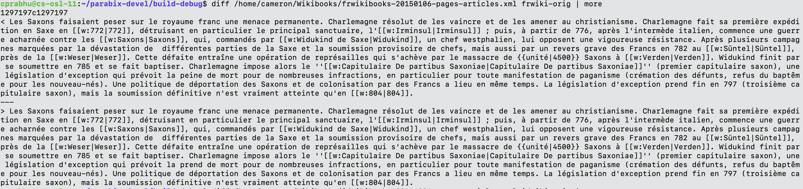

Compression results on an extensively diverse set of Wikibooks files.

1. Basic compression and decompression.
* Min-max symbol length: 3-32 bytes
* Git tag: https://cs-git-research.cs.surrey.sfu.ca/cameron/parabix-devel/-/tags/CMP_DeCMP_v1
* Max number of Unicode word (ztf-symbol) in phrase: 2

| Filename | Size (MB) | Compressed size (MB) | Hashtable (MB) | Time (sec) | Decompression time (sec) |
|---------:|----------:|---------------------:|---------------:|----------: |-------------------------:|
|Arabic    | 18.7523   | 12.5694              | 2.2411         | 4.555      |0.502                     |
|German    | 195.48    | 153.91               | 3.5286         | 47.672     |5.474                     |
|Greek     | 18.7002   | 9.6006               | 2.6703         | 5.138      |0.681                     |
|Spanish   | 70.4887   | 53.196               | 2.1076         | 17.3       |2.024                     |
|Persian   | 19.2197   | 10.1089              | 1.8692         | 5.129      |0.681                     |
|Finnish   | 19.0433   | 13.361               | 2.1648         | 5.229      |0.689                     |
|French    | 87.567    | 64.1632              | 2.2984         | 21.211     |2.57                      |
|Indonesian| 14.4981   | 10.0327              | 1.0014         | 3.842      |0.546                     |
|Japanese  | 53.8666   | 47.1497              | 2.2697         | 12.791     |1.552                     |
|Korean    | 12.0246   | 9.737                | 1.1444         | 3.118      |0.457                     |
|Russian   | 56.4551   | 36.8118              | 3.624          | 14.462     |1.789                     |
|Thai      | 11.0458   | 9.2983               | 0.772476       | 2.825      |0.407                     |
|Turkish   | 11.7863   | 8.3733               | 1.5163         | 3.382      |0.468                     |
|Vietnamese| 11.2978   | 7.4577               | 0.84877        | 3.087      |0.44                      |
|Chinese   | 19.5651   | 14.5817              | 1.8406         | 5.064      |0.704                     |
|All-wiki  | 619.79    | 554.81               | 4.0436         | 148.873    |14.191                    |

2. Using scalable hashtable
* Min-max symbol length: 3-32 bytes
* Git commit SHA: 30e3dede9405064973af836fde2ce153df0e4b8b

| Filename | Size (MB) | Compressed size (MB) | Hashtable (MB) |
|---------:|----------:|---------------------:|---------------:|
|Arabic    | 18.7523   | 10.7836              | 3.7036         |
|German    | 195.48    | 145.47               | 8.5545         |
|Greek     | 18.7002   | 7.6456               | 4.3704         |
|Spanish   | 70.4887   | 50.9866              | 3.1941         |
|Persian   | 19.2197   | 9.1646               | 2.532          |
|Finnish   | 19.0433   | 12.1977              | 3.1733         |
|French    | 87.567    | 61.4654              | 3.5301         |
|Indonesian| 14.4981   | 9.5497               | 1.3796         |
|Japanese  | 53.8666   | 46.2149              | 3.1613         |
|Korean    | 12.0246   | 9.6029               | 1.297          |
|Russian   | 56.4551   | 29.6791              | 8.3315         |
|Thai      | 11.0458   | 9.2451               | 0.832972       |
|Turkish   | 11.7863   | 7.7808               | 2.0695         |
|Vietnamese| 11.2978   | 7.2636               | 1.0205         |
|Chinese   | 19.5651   | 14.138               | 2.3369         |
|All-wiki  | 619.79    | 539.53               | 12.505         |

3. Using weighted selection of hashtable entries
* Min-max symbol length: 3-32 bytes
* Segment size - 1048576 (1024^2) bytes
* Git commit SHA: 500bdbd03ab46b325a5dd70335d2fe35b618d5f7

| Filename | Size (MB) | Compressed file (MB) |  Decompression time (sec)  |
|---------:|----------:|---------------------:|---------------------------:|
|Arabic    | 18.7523   | 12.11                |  0.771                     |
|German    | 195.48    | 131.96               |  4.035                     |
|Greek     | 18.7002   | 9.81                 |  0.766                     |
|Spanish   | 70.4887   | 47.47                |  1.793                     |
|Persian   | 19.2197   | 10.11                |  0.784                     |
|Finnish   | 19.0433   | 12.96                |  0.751                     |
|French    | 87.567    | 56.89                |  2.067                     |
|Indonesian| 14.4981   | 9.54                 |  0.671                     |
|Japanese  | 53.8666   | 48.48                |  1.353                     |
|Korean    | 12.0246   | 10.45                |  0.584                     |
|Russian   | 56.4551   | 33.04                |  1.44                      |
|Thai      | 11.0458   | 9.69                 |  0.571                     |
|Turkish   | 11.7863   | 8.21                 |  0.606                     |
|Vietnamese| 11.2978   | 7.04                 |  0.564                     |
|Chinese   | 19.5651   | 14.93                |  0.726                     |
|All-wiki  | 619.79    | 444.46               |  11.206                    |

Decompression time (sec)
| real | user | sys |
|------|------|-----|
|0.329 |0.342 |0.10 |
|1.422 |2.138 |0.475|
|0.326 |0.303 |0.137|
|0.672 |0.877 |0.244|
|0.333 |0.301 |0.150|
|0.323 |0.292 |0.136|
|0.761 |1.058 |0.248|
|0.296 |0.202 |0.173|
|0.521 |0.642 |0.190|
|0.266 |0.194 |0.124|
|0.552 |0.716 |0.172|
|0.262 |0.167 |0.142|
|0.272 |0.208 |0.126|
|0.255 |0.199 |0.110|
|0.313 |0.264 |0.149|
|3.823 |6.459 |0.924|

================================================================================================================================================================

After mostly ALL compression bug fixes:

* with encoding scheme 1

|size  | file       |
|-----:|-----------:|
|  13M | arwiki.z   |
| 132M | dewiki.z   |
| 9.9M | elwiki.z   |
|  48M | eswiki.z   |
|  11M | fawiki.z   |
|  13M | fiwiki.z   |
|  57M | frwiki.z   |
| 9.6M | idwiki.z   |
|  49M | jawiki.z   |
|  11M | kowiki.z   |
|  34M | ruwiki.z   |
| 9.7M | thwiki.z   |
| 8.3M | trwiki.z   |
| 7.1M | viwiki.z   |
|  15M | zhwiki.z   |
| 445M | wiki-all.z |

================================================================================================================================================================

* with encoding scheme 2

|size  | file       |
|-----:|-----------:|
|  13M | arwiki.z   |
| 133M | dewiki.z   |
| 9.9M | elwiki.z   |
|  48M | eswiki.z   |
|  11M | fawiki.z   |
|  14M | fiwiki.z   |
|  58M | frwiki.z   |
| 9.7M | idwiki.z   |
|  49M | jawiki.z   |
|  11M | kowiki.z   |
|  34M | ruwiki.z   |
| 9.8M | thwiki.z   |
| 8.3M | trwiki.z   |
| 7.2M | viwiki.z   |
|  16M | zhwiki.z   |
| 446M | wiki-all.z |

Decompression failure:

* cprabhu@cs-osl-11:~/parabix-devel/build-debug$ diff /home/cameron/Wikibooks/dewikibooks-20141216-pages-articles.xml dewiki-orig | more
3373413c3373413
`< {{:Staatsbürgerkunde Deutschland/ Vorlage:Include|Staatsbürgerkunde Deutschland/ Geschichte/ Deutsche Teilung|A}}`
---
`> {{:Staatsbürgerkunde Deutschland/ Vorlage:Include|?;?Geschichte/ Deutsche Teilung|A}}`

* cprabhu@cs-osl-11:~/parabix-devel/build-debug$ diff /home/cameron/Wikibooks/jawikibooks-20150103-pages-articles.xml jawiki-orig | more
38876,38877c38876,38877
`<     <ns>0</ns>`
`<     <id>1609</id>`
---
`> e   <ns>0</ns>`
`> e   <id>1609</id>`

================================================================================================================================================================

3. With updated table size:

* 4 -> phraseHashTableSize 4096 * 4 * 1 = 16384
* 5-8 -> phraseHashTableSize 8192 * 8 * 4 = 262144
* 9-16 -> phraseHashTableSize 32768 * 16 * 8 = 4194304
* 17-32 -> phraseHashTableSize 131072 * 32 * 16 = 67108864

| mGroupNo | hashTableSz | freqTableSz |
|---------:|------------:|------------:|
|   0      |  16384      |  4096       |
|   1      |  262144     |  32768      |
|   2      |  4194304    |  262144     |
|   3      |  67108864   |  2097152    |

|size  | file       |
|-----:|-----------:|
|  13M | arwiki.z   |
| 135M | dewiki.z   |
|  11M | elwiki.z   |
|  70M | enwiki.z   |
|  49M | eswiki.z   |
|  11M | fawiki.z   |
|  14M | fiwiki.z   |
|  58M | frwiki.z   |
| 9.4M | idwiki.z   |
|  48M | jawiki.z   |
|  11M | kowiki.z   |
|  35M | ruwiki.z   |
| 9.7M | thwiki.z   |
| 8.5M | trwiki.z   |
| 7.0M | viwiki.z   |
|  15M | zhwiki.z   |
| 449M | wiki-all.z |

================================================================================================================================================================

4. Further optimize hash-table size:

|GroupNo | index space/ length | avail index table size          | Required table size               |  Required sub table size | SUB_TABLE_IDX_MASK_BITS  |
|-------:|--------------------:|--------------------------------:|----------------------------------:|-------------------------:|-------------------------:|
|        |                     | (subTbl_idx_space * #subTables) | index_table_size * max_symbol_len |(subTbl_idx_space*max_len)|                          |
|0       | 8 * 128             | 1024 * 1       =>(1024)         | 1024 * 4 = 4096                   |  4096                    |    10 (1024)             |
|1       | 4 * 128             | 512 * 4        =>(2048)         | 2048 * 8 = 16384                  |  4096                    |    9  (512)              |
|2       | 2 * 128 * 128       | 32768 * 8      =>(262144)       | 262144 * 16 = 4194304             |  524288                  |    15 (32768)            |
|3       | 1 * 128 * 128 * 128 | 2097152 * 16   =>(33554432)     | 33554432 * 32 = 1073741824        |  67108864                |    26 (2097152) -> NO    |
|3       | 1 * 128 * 128       | 16384 * 16     =>(262144)       | 262144 * 32 = 8388608             |  524288                  |    14 (16384)            |

Old  total table size = 1077.956608 MB -> too much!!
New total table size = 12.603392 MB

|size  | file       |
|-----:|-----------:|
|  12M | arwiki.z   |
| 120M | dewiki.z   |
| 9.6M | elwiki.z   |
|  63M | enwiki.z   |
|  44M | eswiki.z   |
| 9.4M | fawiki.z   |
|  13M | fiwiki.z   |
|  52M | frwiki.z   |
| 8.7M | idwiki.z   |
|  48M | jawiki.z   |
|  11M | kowiki.z   |
|  32M | ruwiki.z   |
| 9.7M | thwiki.z   |
| 7.9M | trwiki.z   |
| 6.6M | viwiki.z   |
|  15M | zhwiki.z   |
| 417M | wiki-all.z |

Decompression failure:

* cprabhu@cs-osl-11:~/parabix-devel/build-debug$ diff /home/cameron/Wikibooks/dewikibooks-20141216-pages-articles.xml dewiki-orig | more
3373413c3373413
`< {{:Staatsbürgerkunde Deutschland/ Vorlage:Include|Staatsbürgerkunde Deutschland/ Geschichte/ Deutsche Teilung|A}}`
---
`> {{:Staatsbürgerkunde Deutschland/ Vorlage:Include|?;?Geschichte/ Deutsche Teilung|A}}`

* cprabhu@cs-osl-11:~/parabix-devel/build-debug$ diff /home/cameron/Wikibooks/frwikibooks-20150106-pages-articles.xml frwiki-orig | more

================================================================================================================================================================

5. Phrase indices in hash-table are at multiple of phrase-length

    Value * subTablePtr = b->CreateGEP(hashTableBasePtr, b->CreateMul(b->CreateSub(keyLength, lg.LO), lg.PHRASE_SUBTABLE_SIZE));
    Value * tableIdxHash = b->CreateAnd(b->CreateLShr(codewordVal, 8), lg.TABLE_MASK, "tableIdx");
    Value * keyIdxPtr = b->CreateGEP(subTablePtr, b->CreateMul(tableIdxHash, keyLength));

|size (bytes) | size (MB) |file       |
|------------:|----------:|----------:|
| 11629706    |   12M     | arwiki.z  |
|125620528    |  120M     | dewiki.z  |
| 10044381    |  9.6M     | elwiki.z  |
| 65105178    |   63M     | enwiki.z  |
| 45210035    |   44M     | eswiki.z  |
|  9784518    |  9.4M     | fawiki.z  |
| 12899371    |   13M     | fiwiki.z  |
| 53733214    |   52M     | frwiki.z  |
|  9121376    |  8.7M     | idwiki.z  |
| 50120383    |   48M     | jawiki.z  |
| 10891320    |   11M     | kowiki.z  |
| 33243599    |   32M     | ruwiki.z  |
| 10131021    |  9.7M     | thwiki.z  |
|  8218719    |  7.9M     | trwiki.z  |
|  6860191    |  6.6M     | viwiki.z  |
| 15320449    |   15M     | zhwiki.z  |
|436406764    |  417M     | wiki-all.z|

================================================================================================================================================================

6. Compress 2-symbol phrases of length 5-8 bytes.

Prefix space: C8-CF
Suffix space: 00-7F

|size (bytes) | size (MB) |file       |
|------------:|----------:|----------:|
|   11519924  |   11M     | arwiki.z  |
|  123149235  |  118M     | dewiki.z  |
|    9898518  |  9.5M     | elwiki.z  |
|   63580035  |   61M     | enwiki.z  |
|   44000304  |   42M     | eswiki.z  |
|    9661844  |  9.3M     | fawiki.z  |
|   12688318  |   13M     | fiwiki.z  |
|   52186893  |   50M     | frwiki.z  |
|    8982705  |  8.6M     | idwiki.z  |
|   49616282  |   48M     | jawiki.z  |
|   10804745  |   11M     | kowiki.z  |
|   32428412  |   31M     | ruwiki.z  |
|   10063364  |  9.6M     | thwiki.z  |
|    8092985  |  7.8M     | trwiki.z  |
|    6685366  |  6.4M     | viwiki.z  |
|   15135653  |   15M     | zhwiki.z  |
|  424019887  |  405M     | wiki-all.z|

================================================================================================================================================================

7. Collision handling and phrase-selection embedded in MarkRepeatedHashvalue kernel (commit SHA 89501d0a881fbc1d73882199e53249447738031a)

|GroupNo |SUB_TABLE_IDX_MASK_BITS (avail) | SUB_TABLE_IDX_MASK_BITS (used) | SUB_TABLE_IDX_MASK_BITS (free) |
|-------:|-------------------------------:|-------------------------------:|-------------------------------:|
|        |                                |                                |                                |
|0       |   10 (1024)                    |                7               |            3                   |
|1       |   9  (512)                     |                7               |            2                   |
|2       |   15 (32768)                   |               14               |            1                   |
|3       |   14 (16384)                   |               14               |            0                   |

|size (bytes) | size (MB) |file       |
|------------:|----------:|----------:|
|   11278724  |  11M      | arwiki.z  |
|  123944112  | 119M      | dewiki.z  |
|    9917950  | 9.5M      | elwiki.z  |
|   64347494  |  62M      | enwiki.z  |
|   45226867  |  44M      | eswiki.z  |
|    9895549  | 9.5M      | fawiki.z  |
|   12898784  |  13M      | fiwiki.z  |
|   53937601  |  52M      | frwiki.z  |
|    9229931  | 8.9M      | idwiki.z  |
|   49974176  |  48M      | jawiki.z  |
|   10921715  |  11M      | kowiki.z  |
|   32753905  |  32M      | ruwiki.z  |
|   10154449  | 9.7M      | thwiki.z  |
|    8200615  | 7.9M      | trwiki.z  |
|    7100938  | 6.8M      | viwiki.z  |
|   15407789  |  15M      | zhwiki.z  |
|  425668590  | 406M      | wiki-all.z|

================================================================================================================================================================
8. Linear probing for collision handling.(commit SHA 30dcbdb865bf2004c2b649cfd19f82e56edfc601)

|size (bytes) | size (MB) |file       |
|------------:|----------:|----------:|
|   11106176  |   11M     | arwiki.z  |
|  115147986  |  110M     | dewiki.z  |
|    9868892  |  9.5M     | elwiki.z  |
|   59378526  |   57M     | enwiki.z  |
|   42615291  |   41M     | eswiki.z  |
|    9699254  |  9.3M     | fawiki.z  |
|   12236492  |   12M     | fiwiki.z  |
|   50979291  |   49M     | frwiki.z  |
|    8596216  |  8.2M     | idwiki.z  |
|   49900888  |   48M     | jawiki.z  |
|   10884662  |   11M     | kowiki.z  |
|   32171223  |   31M     | ruwiki.z  |
|   10097245  |  9.7M     | thwiki.z  |
|    7733696  |  7.4M     | trwiki.z  |
|    6443430  |  6.2M     | viwiki.z  |
|   15228393  |   15M     | zhwiki.z  |
|  391285124  |  374M     | wiki-all.z|

================================================================================================================================================================
9.0 Compressed file size vs dictionary size
* Sym count = 2
* Do not compress the first occurrence in every segment
* Uses MarkRepeatedHashvalue: 
    i. Uses BixHash[i] for 2-sym phrases
  iii. CheckUnmark for 2-sym phrases commented.
   iv. Linear probing expand size => b->getSize(0x50)
    v. Modify minFreqReqForCmp => >= 4 for groupNo 0; >= 2 for other groups

| Filename | Size (MB) | Compressed file (MB) |  Dictionary size (MB)      |
|---------:|----------:|---------------------:|---------------------------:|
|Arabic    | 19        | 8.6                  |  2.0                       |
|English   | 96        | 50                   |  5.2                       |
|German    | 196       | 98                   |  9.9                       |
|Greek     | 19        | 7.7                  |  1.8                       |
|Spanish   | 71        | 35                   |  5.3                       |
|Persian   | 20        | 7.7                  |  1.6                       |
|Finnish   | 20        | 9.9                  |  1.8                       |
|French    | 88        | 42                   |  5.4                       |
|Indonesian| 15        | 6.5                  |  1.8                       |
|Japanese  | 54        | 47                   |  1.1                       |
|Korean    | 13        | 11                   |  0.324                     |
|Russian   | 57        | 26                   |  5                         |
|Thai      | 12        | 9.4                  |  0.309                     |
|Turkish   | 12        | 5.9                  |  1.6                       |
|Vietnamese| 12        | 4.9                  |  1.3                       |
|Chinese   | 20        | 14                   |  0.994                     |
